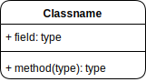
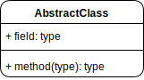
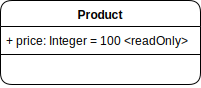
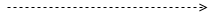
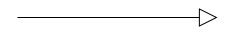
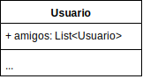
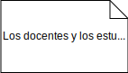
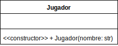
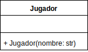

# Diagrama de Clases - UML

El **UML** (Unified Modeling Language) es un lenguaje de modelado que proporciona una notación estándar para visualizar, especificar, construir y documentar los artefactos de un sistema de software. Es la forma de comunicar la estructura, el comportamiento y la interacción de un sistema.

Los **diagramas de clases** son un tipo de diagrama de estructura que se utiliza para modelar el modelo de negocio de un sistema a través de la representación de su estructura orientada a objetos, mostrando las clases del sistema, sus atributos, su comportamiento y las relaciones entre los objetos.

1. [Conceptos Básicos](#conceptos-básicos)
   1. [Clases](#clases)
      1. [Nombre de la clase](#nombre-de-la-clase)
      2. [Atributos](#atributos)
      3. [Métodos u Operaciones](#métodos-u-operaciones)
   2. [Relaciones](#relaciones)
      1. [Dependencia](#dependencia)
      2. [Generalización o Herencia](#generalización-o-herencia)
      3. [Asociación](#asociación)
         1. [Unidireccional](#unidireccional)
         2. [Bidireccional](#bidireccional)
         3. [Autoasociación](#autoasociación)
      4. [Agregación y Composición](#agregación-y-composición)
         1. [Agregación](#agregación)
         2. [Composición](#composición)
      5. [Realización o Implementación](#realización-o-implementación)
2. [Conceptos Avanzados](#conceptos-avanzados)
   1. [Enumeradores](#enumeradores)
   2. [Notas](#notas)
   3. [Atributos Derivados](#atributos-derivados)
   4. [Palabras Clave](#palabras-clave)
   5. [Constructor](#constructor)

- [Datos del Cheat Sheet](#datos-del-cheat-sheet)

# Conceptos Básicos

## Clases

Una **clase** es representada por un rectángulo dividido en tres secciones horizontales.

<div align="center">
    
</div>

* La **primera sección** contiene el nombre de la entidad que representa la clase.
* La **segunda sección** contiene los atributos de la clase.
* La **tercera sección** contiene los métodos de la clase o las *operaciones*.

### Nombre de la clase

El nombre de la clase se escribe en la primera sección del rectángulo, de forma centrada, en negrita y con CamelCase, es decir, la primera letra de cada palabra en mayúscula y sin espacios entre las palabras.

Si la clase es abstracta, se coloca en cursiva.

<div align="center">
    
</div>

### Atributos

Los atributos de la clase se escriben en la segunda sección del rectángulo. Cada atributo se escribe en una línea diferente y se compone de la visibilidad, el nombre del atributo y el tipo de dato.

```
<visibilidad> <nombre>: <tipo>
```

La **visibilidad** puede ser:
- **`+`** para *público*.
- **`-`** para *privado*.
- **`#`** para *protegido*.
- **`~`** para *paquete*.

En la mayoría de los lenguajes actuales estos son los modificadores de acceso más comunes.

El **nombre** del atributo se escribe en minúsculas y con CamelCase.

El **tipo** de dato se escribe en mayúsculas y con CamelCase. Por ejemplo:
* `String`
* `Number`
* `Boolean`
* ...

> Los tipos de datos estan sujetos a las convenciones de cada lenguaje de programación. Sin embargo, se puede utilizar un tipo de dato genérico que se encuentre en la mayoría de los lenguajes de programación aunque el nombre del tipo de dato no sea el mismo. Por ejemplo, en lugar de `String` se puede utilizar `str`. Lo importante en un diagrama de clases es que se entienda el tipo de dato que se está utilizando, no que se utilice el nombre exacto del tipo de dato.

Una versión extendida, pero pocas veces utilizada, incluye el valor por defecto del atributo y otros modificadores de la siguiente manera:

```
<visibilidad> <nombre>: <tipo> = <valor por defecto> <{modificador}>
```

Los modificadores pueden ser:
- **`readOnly`** para atributos de solo lectura.
- **`static`** para atributos de clase.
- **`final`** para atributos que no pueden ser modificados.
- **`const`** para atributos constantes.
- ...

<div align="center">
    
</div>

### Métodos u Operaciones

Los métodos de la clase se escriben en la tercera sección del rectángulo. Cada método se escribe en una línea diferente y se compone de la visibilidad, el nombre del método, los parámetros y el tipo de retorno.

```
<visibilidad> <nombre>(<lista de parámetros>): <tipo de retorno>
```

La **visibilidad** es la misma que para los [atributos](#atributos).

El **nombre** del método se escribe en minúsculas y con CamelCase.

Los **parámetros** se escriben entre paréntesis separados por comas. Cada parámetro se compone de su nombre y su tipo de dato. Si el método no tiene parámetros, se dejan los paréntesis vacíos. Se puede escribir solamente el tipo de dato si el nombre del parámetro no es relevante o viceversa.

El **tipo de retorno** se escribe en mayúsculas y con CamelCase. Si el método no retorna ningún valor, se coloca `void` o no se coloca nada.

<div align="center">
    
</div>

# Relaciones

Las relaciones entre las clases se representan con flechas que unen los rectángulos de las clases involucradas dando información sobre la relación que existe entre ellas. Las relaciones más comunes son:

- **Dependencia**: Una clase ***depende*** de otra clase.
- **Generalización** o **Herencia**: Una clase ***extiende*** de otra clase.
- **Asociación**: Una clase ***interactúa*** con otra clase.
- **Agregación** y **Composición**: Una clase ***forma parte*** de otra clase.
- **Realización** / **Implementacion**: Una clase ***implementa*** una interfaz.

## Dependencia

La **dependencia** es una relación que indica que una clase depende de otra clase. Esta dependencia existe cuando un cambio en una de las clases puede afectar a la otra.

Se representa con una flecha punteada que va desde la clase que depende hacia la clase de la que depende.

<div align="center">
    
</div>

Un ejemplo de dependencia es cuando una clase utiliza un objeto de otra clase como parámetro en un método y/o realiza operaciones sobre él o con él.

<div align="center">
    
</div>

## Generalización o Herencia

La **generalización** o **herencia** es una relación que indica que una clase es una extensión de otra clase. La clase que extiende hereda los atributos y métodos de la clase base.

Se representa con una flecha sólida sin relleno que va desde la clase hijo hacia la clase padre.

<div align="center">
    
</div>

Un ejemplo de herencia es cuando una clase `Vehiculo` es la clase base y las clases `Automovil`, `Motocicleta`, `Bicicleta`, etc. son clases hijas que heredan los atributos y métodos de la clase `Vehiculo`.

<div align="center">
    
</div>

## Asociación

La **asociación** es una relación que indica que una clase interactúa con otra clase. Esta interacción puede ser de uno a uno, de uno a muchos o de muchos a muchos.

Se representa con una línea sólida con punta abierta que va desde la clase que interactúa hacia la clase con la que interactúa. Se pueden añadir multiplicidades en los extremos de la línea para indicar la cantidad de instancias que pueden existir en la relación.


Estas asociaciones pueden ser de tres tipos:
- **Unidireccional**: Cuando una clase interactúa con otra clase, pero la otra clase no interactúa con la primera.
- **Bidireccional**: Cuando dos clases interactúan entre sí.
- **Autoasociación**: Cuando una clase interactúa consigo misma.

A su vez, entra en juego el concepto de **multiplicidad** que indica la cantidad de instancias que pueden existir en la relación. La multiplicidad se representa con un número o un rango de números en los extremos de la línea de asociación.

### Unidireccional

La asociación **unidireccional** es una relación que indica que una clase interactúa con otra clase, pero la segunda no interactúa con la primera.

Un ejemplo de asociación unidireccional es cuando una clase `Persona` tiene una relación con una clase `Direccion`, la persona conoce sus propias direcciones, pero las direcciones no conoce a la persona.

> En este ejemplo se tiene en cuenta que las personas pueden tener ninguna o varias direcciones, pero las direcciones solo pueden pertenecer a una persona.

La asociación unidireccional se representa con una línea sólida con punta abierta que va desde la clase que interactúa hacia la clase con la que interactúa.

<div align="center">
    
</div>

La multiplicidad se representa con un número o un rango de números en los extremos de la línea de asociación. En este caso, se representa que una persona puede tener ninguna o varias direcciones, pero una dirección solo puede pertenecer a una persona.

### Bidireccional

La asociación **bidireccional** es una relación que indica que dos clases interactúan entre sí. Es decir, una clase contiene una referencia a la otra clase y la segunda clase contiene una referencia a la primera clase.

En este caso, vamos a tener una clase `Estudiante` y una clase `Curso`. Un estudiante puede estar inscrito en varios cursos y un curso puede tener varios estudiantes inscritos y ambos deben conocer al otro.

La asociación bidireccional se representa con una línea sólida con punta abierta en ambos extremos que va desde una clase hacia la otra clase.

<div align="center">
    
</div>

### Autoasociación

La **autoasociación** es una relación que indica que una clase interactúa consigo misma. Es decir, una clase contiene una referencia a otra instancia de la misma clase.

En general, no se suele ver mucho en los diagramas de clase, ya que depende de cómo se sienta cómodo uno modelando el sistema. Normalmente, solo se agrega un atributo que haga referencia a la misma clase y con eso es suficiente.

Un ejemplo muy común de autoasociación es cuando un usuario puede tener de amigos a otros usuarios en un sistema. 

<div align="center">
    
</div>

## Agregación y Composición

La **agregación** y la **composición** son relaciones que indican que una clase forma parte de otra clase. La diferencia entre ambas es la duración de la relación y la responsabilidad de la clase que forma parte de la otra clase.

La siguiente tabla muestra las diferencias entre la **agregación** y la **composición**:

|                                   Agregación                                    |                                              Composición                                               |
| :-----------------------------------------------------------------------------: | :----------------------------------------------------------------------------------------------------: |
|              Son representadas por flechas diamantes sin rellenar               |                            Son representadas por flechas diamantes rellenas                            |
|           Los objetos de ambos lados pueden existir de forma aislada.           |    Los objetos en una relación de composición no pueden, conceptualmente, existir de forma aislada.    |
| Si el padre es destruido, los objetos hijos de la relación seguirán existiendo. | Si el objeto padre en una relación de composición se destruye, también se destruyen los objetos hijos. |

Estas dos relaciones pueden tener, como la dependencia, una multiplicidad que indica la cantidad de instancias que pueden existir en la relación.

### Agregación

La **agregación** es una relación que indica que una clase forma parte de otra clase, pero los objetos de ambas clases pueden existir de forma aislada.

Un ejemplo de agregación es cuando tenemos una clase `Equipo` y una clase `Jugador`. Un equipo puede tener varios jugadores y un jugador puede pertenecer a varios equipos. Sin embargo, los jugadores pueden seguir existiendo sin ser parte del equipo.

La agregación se representa con una flecha de diamante sin relleno que va desde la clase que forma parte hacia la clase que contiene.

<div align="center">
    
</div>

La multiplicidad se representa con un número o un rango de números en los extremos de la línea de agregación. En este caso, se representa que un equipo puede tener varios jugadores, pero un jugador puede pertenecer a un solo equipo.

### Composición

La **composición** es una relación que indica que una clase forma parte de otra clase y los objetos de ambas clases no pueden existir de forma aislada.

Un ejemplo de composición es cuando tenemos una clase `Casa` y una clase `Habitacion`. Una casa está compuesta por varias habitaciones y una habitación no puede existir sin estar dentro de una casa.

La composición se representa con una flecha de diamante relleno que va desde la clase que forma parte hacia la clase que contiene.

<div align="center">
    
</div>

En este caso, si la casa se destruye, las habitaciones también se destruyen. Por lo tanto, las habitaciones no pueden existir sin estar dentro de la misma.


## Realización o Implementación

La **realización** o **implementación** es una relación que indica que una clase implementa una interfaz. Es decir, la clase que implementa la interfaz debe definir los métodos de la interfaz.

Se representa con una flecha punteada que va desde la clase que implementa hacia la interfaz.

Un ejemplo de realización es cuando las clases `Estudiante` y `Docente` implementan la interfaz `Persona`, ya que ambos son personas. La interfaz `Persona` define algunas propiedades y métodos que deben ser implementados por dichas clases.

<div align="center">
    
</div>


# Conceptos Avanzados

## Enumeradores

Los enumeradores son un tipo de clase especial que se utiliza para representar un conjunto de constantes. Se representan con la palabra clave _`<<enumeration>>`_ en cursiva en la primera sección del rectángulo.

- Proporcionan atributos (valores), pero generalmente no proporcionan comportamiento, por lo que se pueden dibujar sin la sección de operaciones.
- No es necesario que muestren tipos de atributos, ya que todos los atributos son del tipo del enumerador mismo.
- Tampoco necesitan mostrar modificadores de acceso, ya que se supone que todos los atributos son accesibles si el enumerador en sí es accesible.

<div align="center">
    
</div>


## Notas

Las **notas** son un tipo de comentario que se utiliza para proporcionar información adicional sobre una clase o una relación. Se representan con un rectángulo con una esquina doblada que se conecta con una línea punteada a la clase o relación a la que se refiere. Puede no estar conectado a nada si es una nota general.

<div align="center">
    
</div>

Las notas conectadas a una clase se verían de la siguiente manera:

<div align="center">
    
</div>


## Atributos Derivados

Los **atributos derivados** son atributos que se calculan a partir de otros atributos de la clase. Se representan con una barra inclinada (`/`) antes del nombre del atributo.

Siguiente el ejemplo anterior de la Persona, si se tiene un atributo `fechaNacimiento` y se quiere calcular la edad de la persona, se puede agregar un atributo `edad` que se calcula a partir de la fecha de nacimiento.

<div align="center">
    
</div>

## Palabras Clave

Las **palabras clave** son metadatos adicionales de una entidad. Ya las hemos estado utilizando, por ejemplo, `<<abstract>>` para indicar que una clase es abstracta, `<<enumeration>>` para indicar que una clase es un enumerador o `<<interface>>` para indicar que una clase es una interfaz.

Estas palabras clave se colocan en la primera sección del rectángulo y se escriben en cursiva sin negrita.

<div align="center">
    
</div>

## Constructor

El **constructor** es un método especial que se utiliza para inicializar una clase. Se representa con el nombre `<<constructor>>` en cursiva en la tercera sección del rectángulo.

<div align="center">
    
</div>

Otra manera de representar un constructor es directamente con el nombre de la clase como si fuera un método, pero sin el tipo de retorno.

<div align="center">
    
</div>

En el primer caso, se podría cambiar el nombre del constructor por el que se quiera utilizar, ya que la notación `<<constructor>>` ya indica que es un constructor. En el segundo caso no es posible realizar esto ya que es la convención para representar un constructor sin la palabra clave, sin embargo, es una forma más corta de representarlo.


### Datos del Cheat Sheet

\- Autor: Nicolás Villamonte <br>
\- Fecha: 23/03/2024 <br>
\- Email: nicovillamonte@gmail.com <br>
\- Linkedin: https://www.linkedin.com/in/nicolasvillamonte/ <br>
\- Herramientas y Versiones: Draw.io