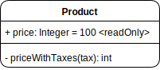

# Diagrama de Clases - UML

El **UML** (Unified Modeling Language) es un lenguaje de modelado que proporciona una notación estándar para visualizar, especificar, construir y documentar los artefactos de un sistema de software. Es la forma de comunicar la estructura, el comportamiento y la interacción de un sistema.

Los **diagramas de clases** son un tipo de diagrama de estructura que se utiliza para modelar el modelo de negocio de un sistema a través de la representación de su estructura orientada a objetos, mostrando las clases del sistema, sus atributos, su comportamiento y las relaciones entre los objetos.

1. []()

# Conceptos Básicos

## Clases

Una **clase** es representada por un rectángulo dividido en tres secciones horizontales.

<div style="width:100%; display:flex;">
    
</div>

* La **primera sección** contiene el nombre de la entidad que representa la clase.
* La **segunda sección** contiene los atributos de la clase.
* La **tercera sección** contiene los métodos de la clase o las *operaciones*.

### Nombre de la clase

El nombre de la clase se escribe en la primera sección del rectángulo, de forma centrada, en negrita y con CamelCase, es decir, la primera letra de cada palabra en mayúscula y sin espacios entre las palabras.

Si la clase es abstracta, se coloca en cursiva.

<div style="width:100%; display:flex;">
    
</div>

### Atributos

Los atributos de la clase se escriben en la segunda sección del rectángulo. Cada atributo se escribe en una línea diferente y se compone de la visibilidad, el nombre del atributo y el tipo de dato.

```
<visibilidad> <nombre>: <tipo>
```

La **visibilidad** puede ser:
- **`+`** para *público*.
- **`-`** para *privado*.
- **`#`** para *protegido*.
- **`~`** para *paquete*.

En la mayoría de los lenguajes actuales estos son los modificadores de acceso más comunes.

El **nombre** del atributo se escribe en minúsculas y con CamelCase.

El **tipo** de dato se escribe en mayúsculas y con CamelCase. Por ejemplo:
* `String`
* `Number`
* `Boolean`
* ...

> Los tipos de datos estan sujetos a las convenciones de cada lenguaje de programación. Sin embargo, se puede utilizar un tipo de dato genérico que se encuentre en la mayoría de los lenguajes de programación aunque el nombre del tipo de dato no sea el mismo. Por ejemplo, en lugar de `String` se puede utilizar `str`. Lo importante en un diagrama de clases es que se entienda el tipo de dato que se está utilizando, no que se utilice el nombre exacto del tipo de dato.

Una versión extendida, pero pocas veces utilizada, incluye el valor por defecto del atributo y otros modificadores de la siguiente manera:

```
<visibilidad> <nombre>: <tipo> = <valor por defecto> <{modificador}>
```

Los modificadores pueden ser:
- **`readOnly`** para atributos de solo lectura.
- **`static`** para atributos de clase.
- **`final`** para atributos que no pueden ser modificados.
- **`const`** para atributos constantes.
- ...

<div style="width:100%; display:flex;">
    
</div>

### Métodos u Operaciones

Los métodos de la clase se escriben en la tercera sección del rectángulo. Cada método se escribe en una línea diferente y se compone de la visibilidad, el nombre del método, los parámetros y el tipo de retorno.

```
<visibilidad> <nombre>(<lista de parámetros>): <tipo de retorno>
```

La **visibilidad** es la misma que para los [atributos](#atributos).

El **nombre** del método se escribe en minúsculas y con CamelCase.

Los **parámetros** se escriben entre paréntesis separados por comas. Cada parámetro se compone de su nombre y su tipo de dato. Si el método no tiene parámetros, se dejan los paréntesis vacíos. Se puede escribir solamente el tipo de dato si el nombre del parámetro no es relevante o viceversa.

El **tipo de retorno** se escribe en mayúsculas y con CamelCase. Si el método no retorna ningún valor, se coloca `void` o no se coloca nada.

<div style="width:100%; display:flex;">
    
</div>

# Relaciones

Las relaciones entre las clases se representan con flechas que unen los rectángulos de las clases involucradas dando información sobre la relación que existe entre ellas. Las relaciones más comunes son:

- **Dependencia**: Una clase ***depende*** de otra clase.
- **Generalización** o **Herencia**: Una clase ***extiende*** de otra clase.
- **Asociación**: Una clase ***interactúa*** con otra clase.
- **Agregación** y **Composición**: Una clase ***forma parte*** de otra clase.

## Dependencia

La **dependencia** es una relación que indica que una clase depende de otra clase. Esta dependencia existe cuando un cambio en una de las clases puede afectar a la otra.

Se representa con una flecha punteada que va desde la clase que depende hacia la clase de la que depende.

<div style="width:100%; display:flex;">
    
</div>

Un ejemplo de dependencia es cuando una clase utiliza un objeto de otra clase como parámetro en un método y/o realiza operaciones sobre él o con él.

<div style="width:100%; display:flex;">
    
</div>

## Generalización o Herencia

La **generalización** o **herencia** es una relación que indica que una clase es una extensión de otra clase. La clase que extiende hereda los atributos y métodos de la clase base.

Se representa con una flecha sólida sin relleno que va desde la clase hijo hacia la clase padre.

<div style="width:100%; display:flex;">
    
</div>

Un ejemplo de herencia es cuando una clase `Vehiculo` es la clase base y las clases `Automovil`, `Motocicleta`, `Bicicleta`, etc. son clases hijas que heredan los atributos y métodos de la clase `Vehiculo`.

<div style="width:100%; display:flex;">
    
</div>

## Asociación

La **asociación** es una relación que indica que una clase interactúa con otra clase. Esta interacción puede ser de uno a uno, de uno a muchos o de muchos a muchos.

Se representa con una línea sólida con punta abierta que va desde la clase que interactúa hacia la clase con la que interactúa. Se pueden añadir multiplicidades en los extremos de la línea para indicar la cantidad de instancias que pueden existir en la relación.


Estas asociaciones pueden ser de tres tipos:
- **Unidireccional**: Cuando una clase interactúa con otra clase, pero la otra clase no interactúa con la primera.
- **Bidireccional**: Cuando dos clases interactúan entre sí.
- **Autoasociación**: Cuando una clase interactúa consigo misma.

....


# Interfaces y Enumeraciones

## Interfaces