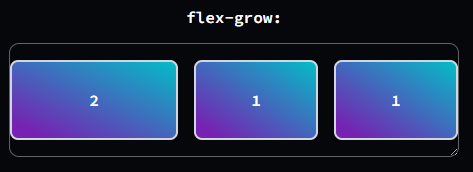
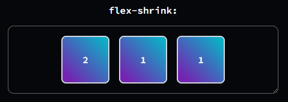

# Flex

Seguramente viste `flex: 1` en algún lado y te preguntaste qué hacía. Es un atajo sumamente útil para controlar el tamaño y la flexibilidad de los elementos dentro de un contenedor flexbox.

Vamos a verlo en detalle.

1. [Los 3 pilares de flex](#los-3-pilares-de-flex)
   1. [`flex-grow`](#1-flex-grow)
   2. [`flex-shrink`](#2-flex-shrink)
   3. [`flex-basis`](#3-flex-basis)
2. [Combinando todo: `flex`](#combinando-todo-flex)
3. [Otros atajos útiles](#otros-atajos-útiles)

## Los 3 pilares de flex

El atajo `flex` combina tres propiedades. Entenderlas por separado es la clave:

### 1. `flex-grow`

Define cuánto puede crecer un elemento en relación a sus hermanos dentro del contenedor flex. Si todos los elementos tienen `flex-grow: 1`, crecerán por igual para llenar el espacio disponible.

```css
.box {
  flex-grow: 1; /* El elemento puede crecer para llenar el espacio disponible */
}
```

<div align="center">
  
</div>

Esto aplica para todos los items al mismo tiempo porque cada uno de ellos tiene la misma clase `.box` y por ende el mismo `flex-grow`. Pero si uno tiene `flex-grow: 2` y los demás `flex-grow: 1`, el primero crecerá el doble que los otros.

<div align="center">
  
</div>

El valor por defecto es `0`, lo que significa que el elemento no crecerá más allá de su tamaño inicial.


### 2. `flex-shrink`

Define la capacidad de un elemento para "encogerse" si no hay suficiente espacio en el contenedor.

```css
.box {
  flex-shrink: 1; /* El elemento puede encogerse si es necesario */
}
```

Si todos los elementos tienen `flex-shrink: 1`, se encogerán proporcionalmente cuando el espacio sea limitado.

<div align="center">
  
</div>

Al igual que con `flex-grow`, si uno tiene `flex-shrink: 2` y los demás `flex-shrink: 1`, el primero se encogerá el doble que los otros.

<div align="center">
  
</div>

El valor por defecto es `1`, lo que significa que los elementos pueden encogerse si es necesario.

Si no queremos que un elemento se encoja, podemos establecer `flex-shrink: 0`.

### 3. `flex-basis`

Define el tamaño inicial del elemento antes de que se apliquen `flex-grow` y `flex-shrink`. Puede ser un valor fijo (como `100px`) o relativo (como `20%`).

```css
.box {
  flex-basis: 100px; /* El elemento comenzará con un tamaño de 100px */
}
```

Valores comunes:

- `auto` (**Valor por defecto**): El tamaño del elemento se basa en su contenido o en su propiedad `width`/`height`.
- `0`: El tamaño inicial es 0, lo que significa que el elemento solo ocupará espacio si crece.
- `100px`, `50%`, etc.: Un tamaño fijo o relativo.


## Combinando todo: `flex`

El atajo `flex` combina las tres propiedades en una sola línea:

```css
flex: <flex-grow> <flex-shrink> <flex-basis>;
```

Por ejemplo:

```css
.box {
  flex: 1 1 0; /* Crece y se encoge según sea necesario, comenzando desde 0 */
}

Este último ejemplo es el combo más común utilizado, por lo que existe un atajo aún más corto para hacer lo mismo y que es muy utilizado:

```css
.box {
  flex: 1; /* Equivalente a flex: 1 1 0% */
}
```

### ¿Qué hace?

Al poner `flex-basis: 0`, le decís al navegador: "Ignora el tamaño del contenido de estos elementos. Trátalos a todos como si empezaran midiendo cero". Luego, con `flex-grow: 1`, el espacio total disponible se reparte de forma perfectamente equitativa entre todos ellos. Y con `flex-shrink: 1`, si el contenedor se hace más pequeño, todos los elementos se encogerán proporcionalmente.

<div align="center">
  
</div>


## Otros atajos útiles

Tabla

| Atajo        | Equivalente completo          | Uso común                                      |
|--------------|-------------------------------|--------------------------------------------------|
| `flex: 1`    | `flex: 1 1 0%`                | El más rápido para crear columnas iguales y flexibles. Idéntico a 1 1 0. |
| `flex: auto` | `flex: 1 1 auto`               | El elemento es flexible, pero su tamaño inicial depende de su contenido. |
| `flex: none` | `flex: 0 0 auto`               | El elemento es totalmente rígido. No crece ni se encoge. |


<br>

### Datos del Cheat Sheet

\- Autor: Nicolás Villamonte <br>
\- Fecha: 22/09/2025 <br>
\- Email: nicovillamonte@gmail.com <br>
\- Linkedin: https://www.linkedin.com/in/nicolasvillamonte/ <br>
\- Herramientas y Versiones: HTML5, CSS3
